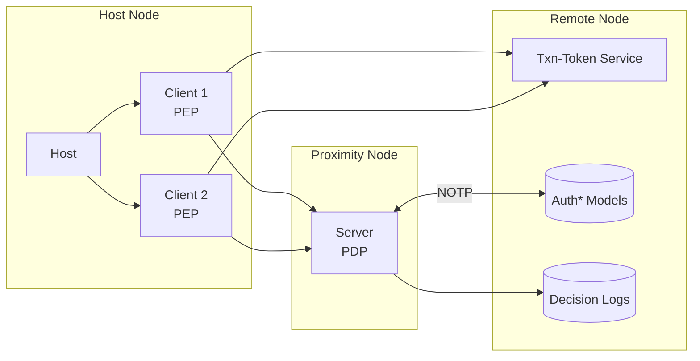
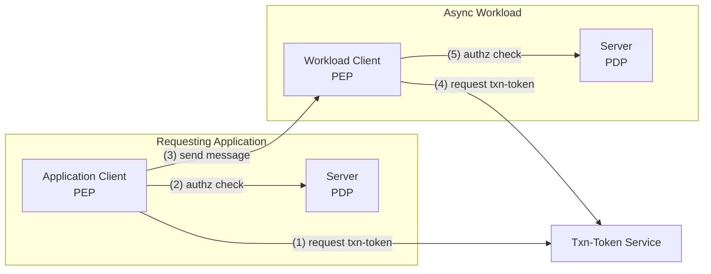

## Client-Host-Server Architecture

**ZTAuth*** employs a client–host–server architecture, defined as follows:

- **Host**: The environment where the client operates (e.g., a server, container, or edge device).
- **Client**: The protected entity (e.g., application, workload, or AI agent) requiring authorization to perform operations. It must possess valid permissions to function correctly.
- **Server**: The authorization server responsible for evaluating access requests and issuing authorization decisions.
- **Transaction Token Service**: A component conforming to the [OAuth Transaction Token specification](https://www.ietf.org/archive/id/draft-ietf-oauth-transaction-tokens-05.html), responsible for issuing tokens to clients. These tokens are used by the PDP to evaluate and authorize specific transactions.

In this architecture:

- The **Client** acts as the **Policy Enforcement Point (PEP)**. It initiates authorization requests and enforces the decisions received.
- The **Server** functions as the **Policy Decision Point (PDP)**. It evaluates policies and returns authorization decisions.
- The **Host** serves as the runtime environment for the PEP.

The Policy Decision Point (PDP) supports two deployment models:

- **Central Authorization Server**: A shared PDP instance serving multiple Policy Enforcement Points (PEPs) across a distributed system.
- **Proximity Authorization Server**: A dedicated PDP instance deployed close to the protected entity, enabling low-latency authorization decisions and continued operation in the event of network disconnection.

> In constrained or resource-limited environments, the PEP and PDP may be co-located on the same host to reduce complexity and improve performance.

**ZTAuth*** is designed to operate reliably in environments with intermittent or absent network connectivity. It employs an **eventual consistency** model in which authorization and trust models — collectively referred to as `auth* models` — are periodically synchronized from a central server.

The **Proximity Authorization Server** synchronizes the `auth* models` using the **Negotiated Object Transfer Protocol (NOTP)**, ensuring that it maintains the latest version required for accurate authorization decisions.

**ZTAuth*** is designed for distributed systems and adheres to the principles of the **CAP Theorem**.

All authorization decisions issued by the PDP **MUST** be recorded in **Decision Logs**. These logs **SHOULD** be transmitted to a **Remote Node** for purposes of **auditing** and **regulatory compliance**.

## Authorization Flow

The **Application Client**, acting as a Policy Enforcement Point (PEP), must ensure that the subject's request can be authorized.

As a first step, the PEP generates a **Transaction Token (Tx-Token)** by invoking the `Transaction Token Service (TTS)`. The request includes the **subject proof** (typically a token) and the **workload proof** (also typically a token).

The `TTS` uses the Trust Model to validate both proofs. The resulting Tx-Token is then sent to the `Policy Decision Point (PDP)` for evaluation, along with an authorization payload describing the access request.  

The authorization payload is an extended structure that is compatible with the [OpenID AuthZEN specification](https://openid.net/specs/authorization-api-1_0-01.html).

The `PDP` evaluates the request by accessing the Auth\* Models, which include both the Authorization Model and the Trust Model.

The diagram above illustrates an authorization flow that includes a communication pattern between nodes, where each node performs its operation independently.

The mechanism used to exchange messages is out of scope for the ****ZTAuth\***** protocol. For example, if communication occurs via API, a token may be regenerated using [OAuth 2.0 Token Exchange](https://datatracker.ietf.org/doc/html/rfc8693). If the message is delivered through a broker or event stream, a different transport mechanism may be used.

This does not affect the authorization flow or semantics defined by ****ZTAuth\*****, which are independent of the communication mechanism and the format used to transmit proofs.
