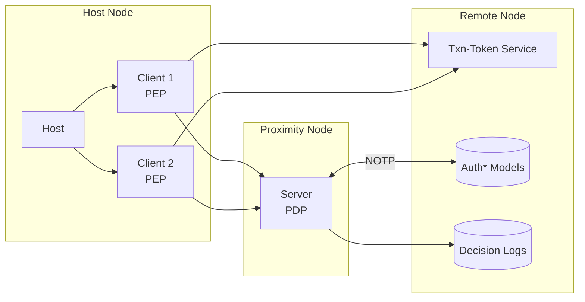

**ZTAuth*** employs a client–host–server architecture, defined as follows:

- **Host**: The environment where the client operates (e.g., a server, container, or edge device).
- **Client**: The protected entity (e.g., application, workload, or AI agent) requiring authorization to perform operations. It must possess valid permissions to function correctly.
- **Server**: The authorization server responsible for evaluating access requests and issuing authorization decisions.
- **Transaction Token Service**: A component conforming to the [OAuth Transaction Token specification](https://www.ietf.org/archive/id/draft-ietf-oauth-transaction-tokens-05.html), responsible for issuing tokens to clients. These tokens are used by the PDP to evaluate and authorize specific transactions.

In this architecture:

- The **Client** acts as the **Policy Enforcement Point (PEP)**. It initiates authorization requests and enforces the decisions received.
- The **Server** functions as the **Policy Decision Point (PDP)**. It evaluates policies and returns authorization decisions.
- The **Host** serves as the runtime environment for the PEP.

The Policy Decision Point (PDP) supports two deployment models:

- **Central Authorization Server**: A shared PDP instance serving multiple Policy Enforcement Points (PEPs) across a distributed system.
- **Proximity PDP**: A local PDP instance deployed close to the workload (e.g., on the same machine or within the same local network), enabling low-latency authorization decisions and continued operation in the event of network disconnection.

> In constrained or resource-limited environments, the PEP and PDP may be co-located on the same host to reduce complexity and improve performance.

**ZTAuth*** is designed to operate reliably in environments with intermittent or absent network connectivity. It employs an **eventual consistency** model in which authorization and trust data — collectively referred to as `auth* models` — are periodically synchronized from a central server.

The **Proximity PDP** synchronizes the `auth* models` using the **Negotiated Object Transfer Protocol (NOTP)**, ensuring that it maintains the latest version required for accurate authorization decisions.

**ZTAuth*** is designed for distributed systems and adheres to the principles of the **CAP Theorem**.

All authorization decisions issued by the PDP **MUST** be recorded in **Decision Logs**. These logs **SHOULD** be transmitted to a **Remote Node** for purposes of **auditing** and **regulatory compliance**.

### Delegation Example

In some scenarios, an application initiates a process that is executed asynchronously, often through a message broker.  
The initiating application possesses a token representing the target identity; however, for security and isolation reasons, this token **MUST NOT** be transmitted via the message broker. Furthermore, the execution may occur at a later time when the original token is no longer valid.

To address this, the initiating application performs a **delegation** to a secondary system. The following steps outline the delegation workflow:

1. The **Requesting Application** requests a transaction token from the **Txn-Token Service**, specifying the intended scope.
2. It performs a local **authorization check** using its own Policy Decision Point (PDP).
3. It sends a **message** to the **Delegated Workload** via the broker.
4. The **Delegated Workload Client** requests a transaction token using its own non-human identity.
5. The **Workload PDP** validates the request using the transaction token and the appropriate `auth* models`.

This mechanism enables secure, auditable, and context-aware delegation without requiring the transmission of the original identity token across systems.

### Centralized Management Benefits

Centralized control of `auth* models` and decision logs provides several key advantages:

- **Governance**: Ensures consistent application of policies across all components and environments.
- **Compliance**: Facilitates adherence to internal policies and external regulatory requirements.
- **Auditing**: Enables complete traceability and retrospective analysis of authorization decisions.
- **Risk Management**: Supports the identification and mitigation of security or operational issues through historical data analysis.
