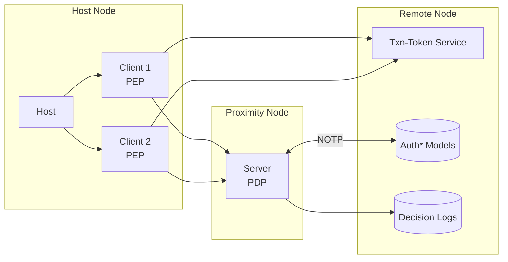

**ZTAuth*** uses a client-host-server architecture:

- The **host** is where the client runs (for example: a server, container, or edge device).
- The **client** is the system, application, or workload that needs to be protected. It must have the correct permissions to do its job.
- The **server** is the authorization server. It checks requests and returns decisions.
- The **txn-token service** implements the [oauth transaction token specification](https://drafts.oauth.net/oauth-transaction-tokens/draft-ietf-oauth-transaction-tokens.html). It gives the client the tokens needed to make authorization decisions.

In this setup:

- The **client** is also called the **Policy Enforcement Point (PEP)**. It sends requests and applies the decisions.
- The **server** is also called the **Policy Decision Point (PDP)**. It checks the policies and makes the decisions.
- The **host** is where the client runs.

The PDP can run in two ways:

- As a **central authorization server**, shared across multiple clients.
- As a **proximity PDP**, running close to the workload (on the same machine or local network). This allows fast decisions and works even if disconnected.

> In small or limited environments, the PEP and PDP can run together on the same host to make things simpler and faster.

**ZTAuth*** works well in systems that are disconnected or only sometimes connected. It is **eventually consistent**: the authorization and trust models — called `Auth* Models` — are updated from the central server regularly.

The **Proximity PDP** syncs the **Auth\*** models using the **Negotiated Object Transfer Protocol (NOTP)**.  
This makes sure it always has the latest version of the model for making decisions.

**ZTAuth*** is made for distributed systems and follows the ideas of the **CAP Theorem**.

All decisions from the PDP must be saved in **Decision Logs**. These logs should go to the **Remote Node**, where they can be used for **auditing** and **compliance**.

### Delegation Example

Sometimes, an application starts a process that runs later, using a message broker.  
The application has a token that represents the target identity, but it **cannot send this token** through the broker — for security and isolation reasons.  
Also, the process might run later, when the token is no longer valid.

To handle this, the application **delegates** the work to another system. Here’s what happens:

1. The **Requesting Application** asks the Txn-Token Service  for a token, with the right scope.
2. It does a local **authorization check** using its own PDP.
3. It sends a **message** to the **Delegated Workload**.
4. The **Delegated Workload Client** asks for a transaction token, using its own non-human identity.
5. The **Workload PDP** checks authorization using the token and the correct Auth\* models.

This allows safe and consistent authorization without needing to share the original token.

### Why Centralized Management Helps

Having central control of **Auth\*** models and logs brings many benefits:

- **Governance**: The same rules are used everywhere.
- **Compliance**: Helps meet internal and external rules.
- **Auditing**: All decisions can be tracked and reviewed.
- **Risk Management**: Old data can help find and reduce problems.
