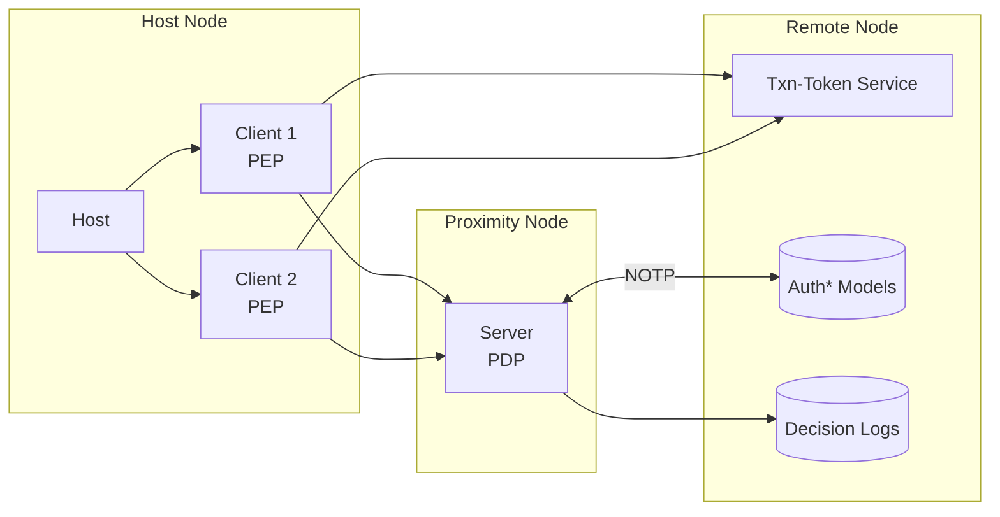
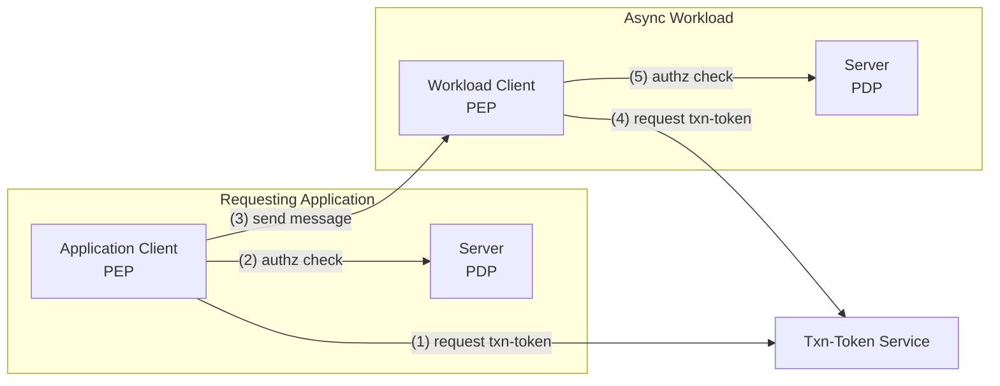

**ZTAuth*** employs a client–host–server architecture, defined as follows:

- **Host**: The environment where the client operates (e.g., a server, container, or edge device).
- **Client**: The protected entity (e.g., application, workload, or AI agent) requiring authorization to perform operations. It must possess valid permissions to function correctly.
- **Server**: The authorization server responsible for evaluating access requests and issuing authorization decisions.
- **Transaction Token Service**: A component conforming to the [OAuth Transaction Token specification](https://www.ietf.org/archive/id/draft-ietf-oauth-transaction-tokens-05.html), responsible for issuing tokens to clients. These tokens are used by the PDP to evaluate and authorize specific transactions.

In this architecture:

- The **Client** acts as the **Policy Enforcement Point (PEP)**. It initiates authorization requests and enforces the decisions received.
- The **Server** functions as the **Policy Decision Point (PDP)**. It evaluates policies and returns authorization decisions.
- The **Host** serves as the runtime environment for the PEP.

The Policy Decision Point (PDP) supports two deployment models:

- **Central Authorization Server**: A shared PDP instance serving multiple Policy Enforcement Points (PEPs) across a distributed system.
- **Proximity Authorization Server**: A dedicated PDP instance deployed close to the protected entity, enabling low-latency authorization decisions and continued operation in the event of network disconnection.

> In constrained or resource-limited environments, the PEP and PDP may be co-located on the same host to reduce complexity and improve performance.

**ZTAuth*** is designed to operate reliably in environments with intermittent or absent network connectivity. It employs an **eventual consistency** model in which authorization and trust data — collectively referred to as `auth* models` — are periodically synchronized from a central server.

The **Proximity Authorization Server** synchronizes the `auth* models` using the **Negotiated Object Transfer Protocol (NOTP)**, ensuring that it maintains the latest version required for accurate authorization decisions.

**ZTAuth*** is designed for distributed systems and adheres to the principles of the **CAP Theorem**.

All authorization decisions issued by the PDP **MUST** be recorded in **Decision Logs**. These logs **SHOULD** be transmitted to a **Remote Node** for purposes of **auditing** and **regulatory compliance**.

### Trust Example

In certain scenarios, an application initiates a process that is executed asynchronously, often via a message broker or event stream. The initiating application (the *Requesting Application*) holds a token representing the **target identity**—the entity on whose behalf an action should eventually be performed.

For security, isolation, and auditability reasons, the original token **MUST NOT** be transmitted over the message broker with its signature. Moreover, execution may occur at a later time, when the original token is expired or otherwise invalid.

To address this, the system enables **authorized impersonation**, allowing the asynchronous workload to execute within a constrained and verifiable identity context derived from the initiating identity, without directly possessing its credentials.

The flow proceeds as follows:

## 1. Transaction Token Request by Requesting Application

The *Requesting Application* **SHALL** request a **Transaction Token** from the **Transaction Token Service**.  
The request **MUST** explicitly declare the intended `scope`, `audience`, and `authorization context`.

## 2. Local Authorization with Context Elevation

The *Requesting Application* **SHALL** elevate its non-human identity to the authorization context of the *target identity*  
and perform a local authorization check using its own **Policy Decision Point (PDP)** to validate whether the requested operation is permitted.

1. **Transaction Token Request by Requesting Application**: The *Requesting Application* **SHALL** request a **Transaction Token** from the **Transaction Token Service**. The request **MUST** explicitly declare the intended `scope`, `audience`, and `authorization context`.
2. **Local Authorization with Context Elevation**: The *Requesting Application* **SHALL** elevate its non-human identity to the authorization context of the *target identity*  
and perform a local authorization check using its own **Policy Decision Point (PDP)** to validate whether the requested operation is permitted.
3. **Message Dispatch to Asynchronous Workload**: The *Requesting Application* **SHALL** dispatch a message via a broker to the **Async Workload**. This message **MUST NOT** include any token issued to the original identity.
4. **Transaction Token Request by Async Workload**: Upon message receipt, the **Async Workload** **SHALL** use its own non-human identity to request a **Transaction Token**  
from the **Transaction Token Service**.
5. **Authorization Evaluation by Workload PDP**:The **Workload PDP** **SHALL** elevate the non-human identity of the **Async Workload** to the authorization context of the *target identity*. It **SHALL** evaluate the request using the **Transaction Token** and applicable `auth*` models, enforcing all impersonation and scope-based policies.

This model supports **secure context propagation** in asynchronous systems without compromising identity integrity or token security.

### Centralized Management Benefits

Centralized control of `auth* models` and decision logs provides several key advantages:

- **Governance**: Ensures consistent application of policies across all components and environments.
- **Compliance**: Facilitates adherence to internal policies and external regulatory requirements.
- **Auditing**: Enables complete traceability and retrospective analysis of authorization decisions.
- **Risk Management**: Supports the identification and mitigation of security or operational issues through historical data analysis.
