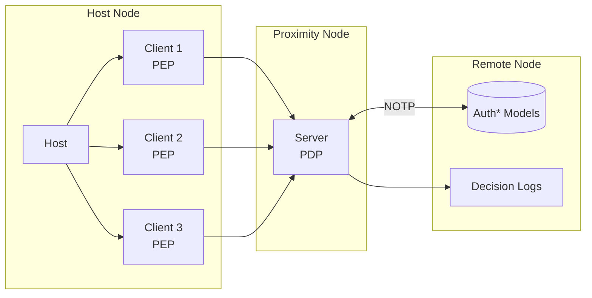

ZTAuth* uses a client-host-server architecture:

- The **host** is the application or system that needs to be protected.
- The **client** is the workload that sends a request and needs permission to do something.
- The **server** is the authorization service that checks the request and returns a decision.

In this setup:

- The **client** is also called the **Policy Enforcement Point (PEP)**. It sends the request and applies the decision.
- The **server** is called the **Policy Decision Point (PDP)**. It checks the policies and makes the decision.
- The **host** is where the PEP runs.

The PDP can be deployed in two ways:

- As a **central authorization server**, running remotely and shared across services.
- As a **proximity PDP**, running close to the workload on the same node or local network. This enables low-latency checks and local decision-making, even in offline or degraded environments.

> In hardware-constrained setups, the PEP and PDP can run on the same node to reduce latency and simplify deployment.

ZTAuth* supports disconnected or partially connected environments.  
The protocol is designed to be **eventually consistent**: AuthN, AuthZ, and trust models are periodically synchronized from the central authorization server.

The **Proximity PDP** must synchronize the **Auth\*** models using the **Negotiated Object Transfer Protocol (NOTP)**. This ensures it always has the latest models and can make decisions based on them.

Every decision made by the PDP is recorded in the **decision logs**. These logs should be sent to the **Remote Node** for storage, so they can be used later for **auditing** and **compliance**.
