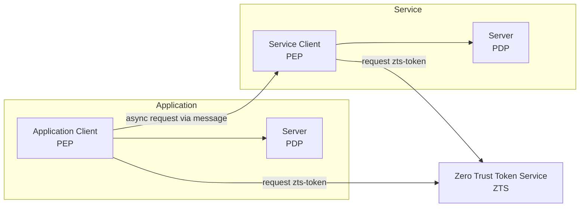

ZTAuth* uses a client-host-server architecture:

- The **host** is the environment where the client runs, such as a server, container, or edge device.
- The **client** is either the system, application or workload that needs to be protected and must ensure it has the correct permissions to perform its actions.
- The **server** is the authorization service that checks the request and returns a decision.
- The **zero trust token service (zts)** is the service that provides the necessary tokens and models to help the client make authorization decisions.

In this setup:

- The **client** is also called the **policy enforcement point (pep)**. It sends the request and applies the decision.
- The **server** is also called the **policy decision point (pdp)**. It checks the policies and makes the decision.
- The **host** is where the client runs.

The PDP can be deployed in two ways:

- As a **central authorization server**, running remotely and shared across services.
- As a **proximity pdp**, running close to the workload on the same node or local network. This enables low-latency checks and local decision-making, even in offline or degraded environments.

> In hardware-constrained setups, the PEP and PDP can run on the same node to reduce latency and simplify deployment.

ZTAuth* supports disconnected or partially connected environments. It is therefore designed to be **eventually consistent**: authorization and trust models — also known as `Auth* Models` — are periodically synchronized from the central authorization server.

The **Proximity PDP** must synchronize the **Auth\*** models using the **Negotiated Object Transfer Protocol (NOTP)**. This ensures it always has the latest models and can make decisions based on them.

**ZTAuth*** is designed for distributed systems and takes into account the constraints imposed by the CAP Theorem.

A common scenario involves an application initiating an asynchronous process that is distributed via a message broker. The application holds the access token of the target identity but cannot propagate it through the broker due to security, isolation, and propagation limitations. Moreover, since the process may be executed at an undefined later time, there is no guarantee that the original token will still be valid when the action takes place.

Instead, the application **delegates the execution** to a downstream service. The service performs the following steps:

1. **Authenticates itself** using its own non-human identity,
2. **Requests a ZTS token** from the Zero Trust Token Service (ZTS), scoped to the intended request context,
3. The **proximity PDP retrieves the relevant Auth\*** models,
4. **Uses the ZTS token** to construct the appropriate **authorization context**,
5. **An authorization decision is made** based on the current authorization context.

This mechanism ensures that authorization is applied securely and consistently, even across asynchronous and decoupled components. It enables safe and verifiable delegation without requiring direct propagation of end-user credentials or tokens.

Every decision made by the PDP is recorded in the **decision logs**. These logs should be sent to the **Remote Node** for storage, so they can be used later for **auditing** and **compliance**.

Centralized management of **Auth\*** models and decision logs enables:

- **Governance**: Policies are applied consistently across distributed components.
- **Compliance**: Facilitates adherence to regulatory and organizational requirements.
- **Auditing**: All authorization decisions are traceable and verifiable.
- **Risk Management**: Historical data supports detection and mitigation of security or operational risks.
